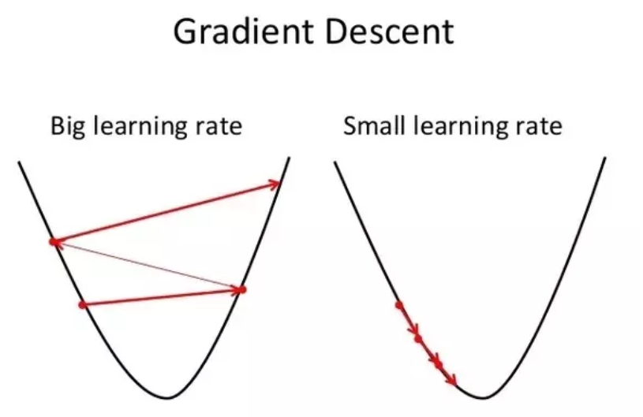

```{r setup, include=FALSE}
knitr::opts_chunk$set(echo=TRUE, message=FALSE, warning=FALSE, fig.align="center")
```

<script type="text/javascript" async
  src="https://cdnjs.cloudflare.com/ajax/libs/mathjs/5.1.2/math.js">
</script>

***

## 程式說明

此程式示範如何用梯度下降(Gradient Descent)方法找出線性迴歸最佳參數解。實作參考自國立台灣大學資訊網路與多媒體研究所**李宏毅**老師的Youtube教學影片：

1. [ML Lecture 1: Regression - Case Study](https://www.youtube.com/watch?v=fegAeph9UaA&index=3&list=PLJV_el3uVTsPy9oCRY30oBPNLCo89yu49)

2. [ML Lecture 1: Regression - Demo](https://www.youtube.com/watch?v=1UqCjFQiiy0&list=PLJV_el3uVTsPy9oCRY30oBPNLCo89yu49&index=4)

***

## 使用套件

`tidyverse`為R軟體專為資料科學的集合套件，裡面包含常用的`dplyr`及`ggplot2`等常用的資料科學套件。詳情資訊可至[tidyverse套件官網](https://www.tidyverse.org/)查看。

```{r use package, eval=TRUE}
library(tidyverse)
```

***

## 使用資料集及分析問題

本次資料集使用`ggplot2`套件內提供的鑽石(`diamonds`)資料集，裡面共包含53,940筆及10個特徵資料。分析的問題為給定在切割(cut)為理想型(Ideal)及淨度(clarity)為內部完美無瑕(IF)的鑽石資料集下，以克拉做為特徵資料(即解釋變數)，建立線性迴歸模型，預測鑽石價格(即被解釋變數)。有關鑽石的知識，可參考此[網站](https://www.alren.com.hk/CHT/CMS/Diamond-Education/14)。

預測的迴歸式如下，下標`i`代表樣本：

$$Price_i=\hat{\alpha} + \hat{\beta_1} Carat_i + \varepsilon_i$$

資料整理程式碼如下所示：

```{r diamonds data, eval=TRUE}
data <- diamonds %>% 
  filter((cut=="Ideal") & (clarity=="IF")) %>%
  select(price, carat)
data
```

經過`filter`挑選切割(cut)為理想型(Ideal)及淨度(clarity)為內部完美無瑕(IF)的鑽石資料集後，只剩下1,212筆資料。

***

## 迴歸函數與封閉解法

我們直接透過R軟體的`lm`函數，直接跑線性迴歸模型，估計出參數值。

```{r diamonds reg, eval=TRUE}
model <- lm(price ~ carat, data = data)
model
```

估計出來的模型的$\hat{\alpha}=-3403$，$\hat{\beta_1}=11682$。

繪製圖形觀看迴歸線配適狀況:

```{r diamonds reg graph, eval=TRUE}
ggplot(data, aes(x = carat, y = price)) + 
  geom_point() +
  stat_smooth(method = "lm")
```

除透過程式的函數外，也可直接以線性迴歸的封閉解(Closed-form solution)進行計算：

$$\beta=(X^TX)^{-1}X^TY$$

```{r diamonds closed form, eval=TRUE}

# 整理解釋變數資料並轉為matrix格式
x <- data %>% 
  transmute(Intercept = 1, carat) %>%
  as.matrix()

# 整理被解釋變數資料並轉為vector格式
y <- data %>% pull(price)

# 封閉解
beta <- (solve(t(x) %*% x) %*% t(x) %*% y)

beta
```

可以發現封閉解解法和套件執行的結果是一樣的。

***

## 梯度下降法

為了有「機器學習」的感覺，此處示範以梯度下降法的方式，來找出線性迴歸最佳的參數。

在線性迴歸模型中，誤差函數(Error Function)為均方誤差(MSE, Mean squared error)：


$$ L(\hat{\alpha}, \hat{\beta_1}) = \frac{1}{N} \sum_{n=1}^{N} (y_{i}-\hat{y_{i})}^{2}=\frac{1}{N} \sum_{n=1}^{N}(y_{i} - \hat{\alpha} - \hat{\beta_1} Carat_i)^{2}$$

接下來將誤差函數對$\hat{\alpha}$及$\hat{\beta_1}$進行偏微分，得到梯度下降的計算式：

$$\frac{\partial L}{\partial \hat{\alpha}} = \frac{1}{N} \sum_{n=1}^{N} 2(y_{i} - \hat{\alpha} - \hat{\beta_1} Carat_i)(-1)$$

$$\frac{\partial L}{\partial \hat{\beta_1}} = \frac{1}{N} \sum_{n=1}^{N} 2(y_{i} - \hat{\alpha} - \hat{\beta_1} Carat_i)(-Carat_i)$$

每次疊代時，參數依據學習比率乘上梯度值進行調整。

```{r diamonds gradient descent, eval=TRUE}

# 設定梯度下降參數
lr <- 0.1                 # 學習比率
maxIterations <- 20000    # 最大疊代次數
y <- data$price           # 被解釋變數資料
x <- data$carat           # 解釋變數資料
alpha <- 0                # 截距項初始值
beta <- 0                 # 解釋變數係數初始值
iterations <- 1           # 疊代次數起始值
traningRecord <- tibble(alpha, beta)   # 儲存訓練過程資訊

while(iterations <= maxIterations){
  
  # 以目前的截距項及特徵係數值進行預測
  yPred <- alpha + beta * x
  
  # 損失函數對截距項進行偏微分
  alphaGrad <- sum(2 * (y - yPred) * (-1)) / nrow(data)  
  
  # 損失函數對特徵係數進行偏微分
  betaGrad <- sum(2 * (y - yPred) * (-x)) / nrow(data)   
  
  # 提前終止條件
  if((abs(alphaGrad)<=(10^(-5))) & all(abs(betaGrad)<=(10^(-5)))){
    
    cat("在第" ,iterations,"次 疊代已達收斂條件\n")
    break
    
  }else if((abs(alphaGrad)>=(10^(10))) & all(abs(betaGrad)>=(10^(10)))){
    
    cat("在第" ,iterations,"次 確認數值發散，終止運作\n")
    break
  }
  
  # 調整截距項及特徵係數值
  alpha <- alpha - lr * alphaGrad
  beta <- beta - lr * betaGrad
  
  # 記錄疊代次數
  iterations <- iterations + 1    
  
  # 記錄訓練資訊
  traningRecord <- traningRecord %>% 
    bind_rows(tibble(alpha, beta))
}

# 整理學習結果
tibble(Intercept = alpha, carat = beta)

```

由結果可以看出，經過1,582次的訓練後，梯度下降法得到的係數值與`lm`函數及封閉解的結果相同，訓練成功！

我們可以透過繪圖來了解機器學習的過程，首先需先繪製出誤差函數的等高線圖，再來將學習路徑標示在圖上。

```{r learning graph, eval=TRUE}

# 計算不同截距項及係數項組合下的誤差函數值
plotData <- NULL
for(alpha in seq(-6000, 3000, 500)){
  for(beta in seq(0, 24000, 500)){
    
    # 計算均方誤差
    yPred <- alpha+ beta %*% t(x)
    mse <- sum((y-yPred)^2) / length(y)
    
    # 紀錄資訊
    plotData <- plotData %>% bind_rows(tibble(alpha, beta, mse))
  }
}

# 繪製誤差函數的等高線圖形 並加入學習過程
ggplot(plotData, aes(x = beta, y = alpha, z = mse)) +
  # 繪製等高線圖
  stat_contour(aes(colour = ..level..), size = 1.3, bins = 20) +
  # 修改等高線顏色
  scale_colour_gradientn(colours = rainbow(20), name = "均方誤差") +
  # 修改x軸名稱
  xlab("beta") +
  # 修改y軸名稱
  ylab("alpha") +
  # 標註梯度疊代每次的點位
  geom_point(data = traningRecord, 
             mapping = aes(x = beta, y = alpha), 
             size = 1.3, shape = 21, fill = "white")

```

由圖可以看出，電腦從初始值(0,0)的地方，透過梯度下降法，一路收斂到均方誤差最小的地方。

學習比率是梯度下降法中重要的參數，若設定太小，收斂速度會太慢。但若設定值太大，則會有梯度爆炸(Gradient explosion)的狀況出現，係數值會發散而無法收斂。

```{r print kbar graph, echo=FALSE, out.height="800px", out.width="640px"}

```

學習比率的設定依各個資料集的狀況而有所不同，在此範例中，若學習比率設定為0.9，就會發生梯度爆炸的狀況，如下圖：


```{r gradient explosion, echo=FALSE}

# 設定梯度下降參數
lr <- 0.9                 # 學習比率
maxIterations <- 20000    # 最大疊代次數
y <- data$price           # 被解釋變數資料
x <- data$carat           # 解釋變數資料
alpha <- 0                # 截距項初始值
beta <- 0                 # 解釋變數係數初始值
iterations <- 1           # 疊代次數起始值
traningRecord <- tibble(alpha, beta)   # 儲存訓練過程資訊

while(iterations <= maxIterations){
  
  # 以目前的截距項及特徵係數值進行預測
  yPred <- alpha + beta * x
  
  # 損失函數對截距項進行偏微分
  alphaGrad <- sum(2 * (y - yPred) * (-1)) / nrow(data)  
  
  # 損失函數對特徵係數進行偏微分
  betaGrad <- sum(2 * (y - yPred) * (-x)) / nrow(data)   
  
  # 提前終止條件
  if((abs(alphaGrad)<=(10^(-5))) & all(abs(betaGrad)<=(10^(-5)))){
    break
    
  }else if((abs(alphaGrad)>=(10^(10))) & all(abs(betaGrad)>=(10^(10)))){
    break
  }
  
  # 調整截距項及特徵係數值
  alpha <- alpha - lr * alphaGrad
  beta <- beta - lr * betaGrad
  
  # 記錄疊代次數
  iterations <- iterations + 1    
  
  # 記錄訓練資訊
  traningRecord <- traningRecord %>% 
    bind_rows(tibble(alpha, beta))
}

# 箭頭資料
arrowData <- traningRecord %>% 
  mutate(alphaGo=lead(alpha,1),
         betaGo=lead(beta,1)) %>%
  na.omit

# 繪製梯度爆炸使用
arrowData <- arrowData %>%  slice(1:15)

# 繪製誤差函數等高線圖
plotData <- NULL
for(alpha in seq(-6000, 3000, 500)){
  for(beta in seq(0, 24000, 500)){
    
    # 計算均方誤差
    yPred <- alpha+ beta %*% t(x)
    mse <- sum((y-yPred)^2) / length(y)
    
    # 紀錄資訊
    plotData <- plotData %>% bind_rows(tibble(alpha, beta, mse))
  }
}

# 繪製機器學習過程
ggplot(plotData, aes(x = beta, y = alpha, z = mse)) +
  # 繪製等高線圖
  stat_contour(aes(colour = ..level..), size = 1.3, bins = 20) +
  # 修改等高線顏色
  scale_colour_gradientn(colours = rainbow(20), name = "均方誤差") +
  # 修改x軸名稱
  xlab("beta") +
  # 修改y軸名稱
  ylab("alpha") +
  geom_segment(data=arrowData, mapping=aes(x=beta, y=alpha, xend=betaGo, yend=alphaGo),   
               size=1.2, 
               color="black") +
  # 標註梯度疊代每次的點位
  geom_point(data = arrowData, 
             mapping = aes(x = beta, y = alpha), 
             size = 1.3, shape = 21, fill = "white")
```


